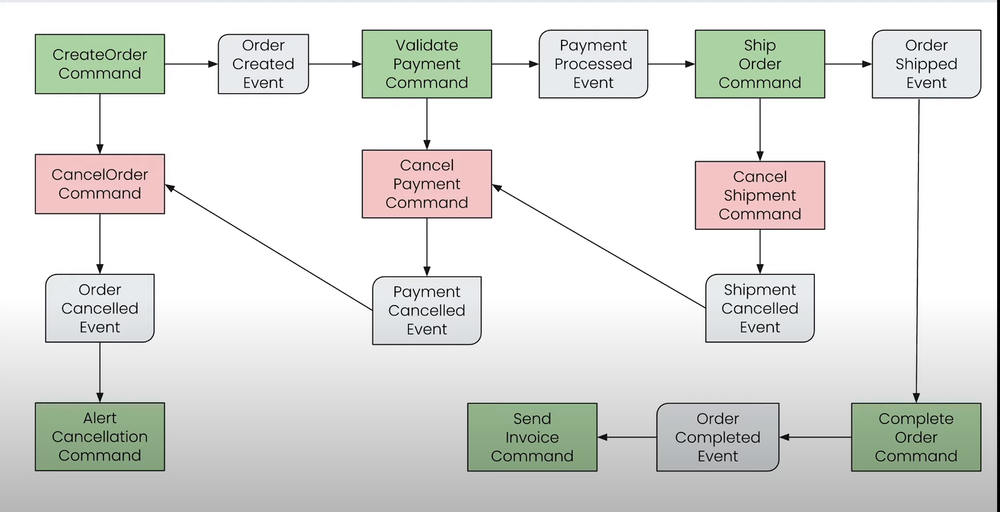

## Saga Orchestration pattern with axon server

**docker-compose.yml** :

```yaml
services:
  axonserver:
    image: axoniq/axonserver
    hostname: axonserve
    volumes:
      - axonserver-data:/data
      - axonserver-events:/eventdata
      - axonserver-config:/config:ro
    ports:
      - '8024:8024'
      - '8124:8124'
      - '8224:8224'


  volumes:
    axonserver-data:
      driver: local
      driver_opts:
        type: none
        device: $AXON_DATA/data
        o: bind
    axonserver-events:
      driver: local
      driver_opts:
        type: none
        device: $AXON_DATA/events
        o: bind
    axonserver-config:
      driver: local
      driver_opts:
        type: none
        device: $AXON_DATA/config
        o: bind

```
References
- [Daily Code Buffer](https://github.com/shabbirdwd53/event-driven-microservices/tree/saga-orchestration)

### Flow for this pattern.



**Note**: Only few of the above are only implemented.

#### Changes
- [v0.3.0](https://github.com/tuhin47/spring-micro-47/releases/tag/0.3.0)

#### Remarks

- [ForbiddenClassException appears during handling Axon event?](https://stackoverflow.com/a/75628094/7499069)
- Event id as a long creates [some issue](https://trello.com/1/cards/64b5504240f74032d076a692/attachments/64b8b75f624fd29552ceb868/download/axonerror.log). Tries with string. it resolves the issue
-  <details>
      <summary>Axon Server doesn't natively support distributed tracing with Zipkin out of the box</summary>
      Axon Server is a specialized event store and message router for applications based on the Axon Framework. As of my last update in September 2021, Axon Server doesn't natively support distributed tracing with Zipkin out of the box.
  </details>

### Todo
- Zipkin Propagation
- Exception/Negative flow implementation
- Logger using AOP concept